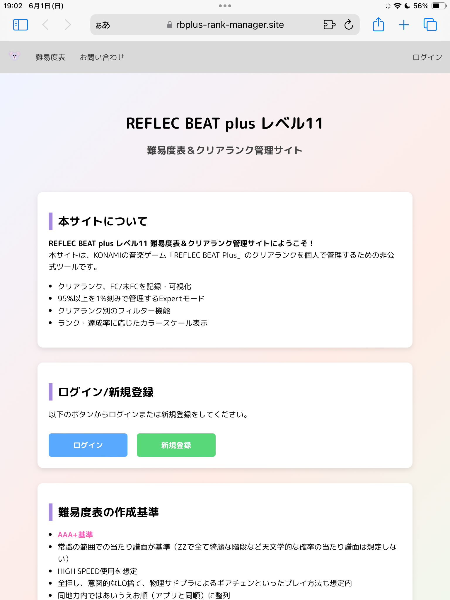
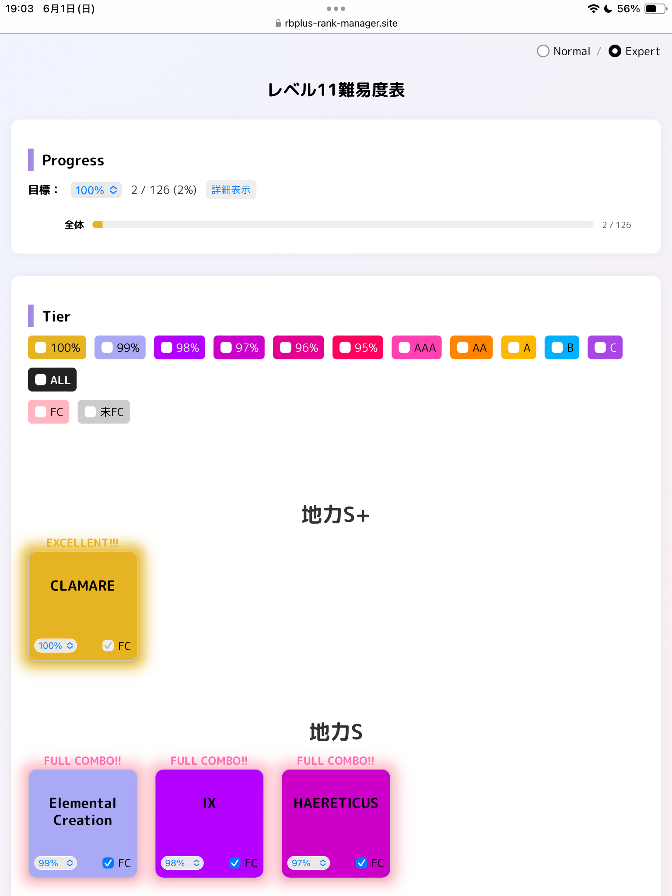
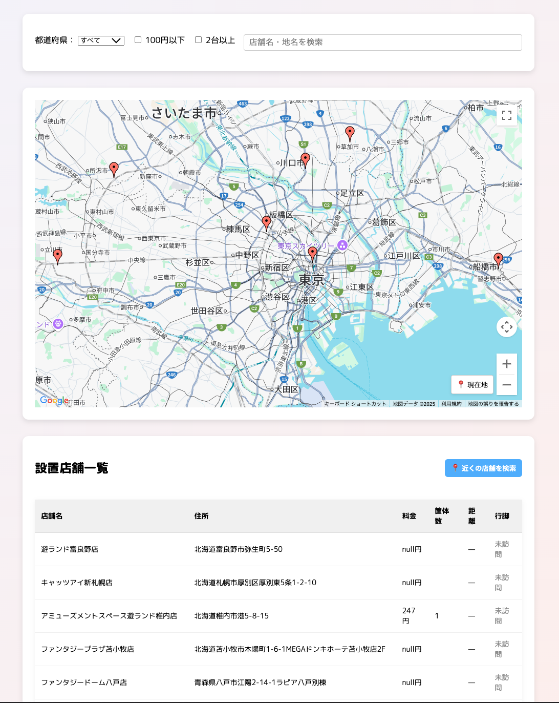
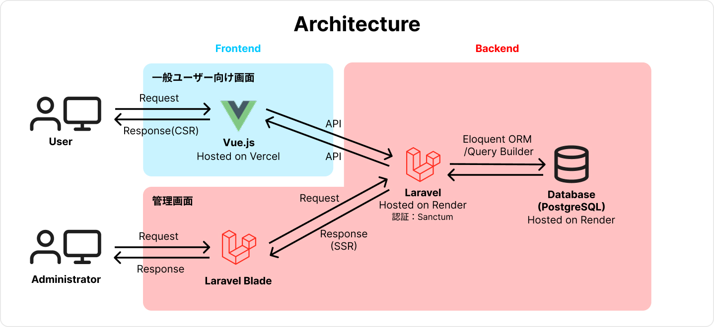
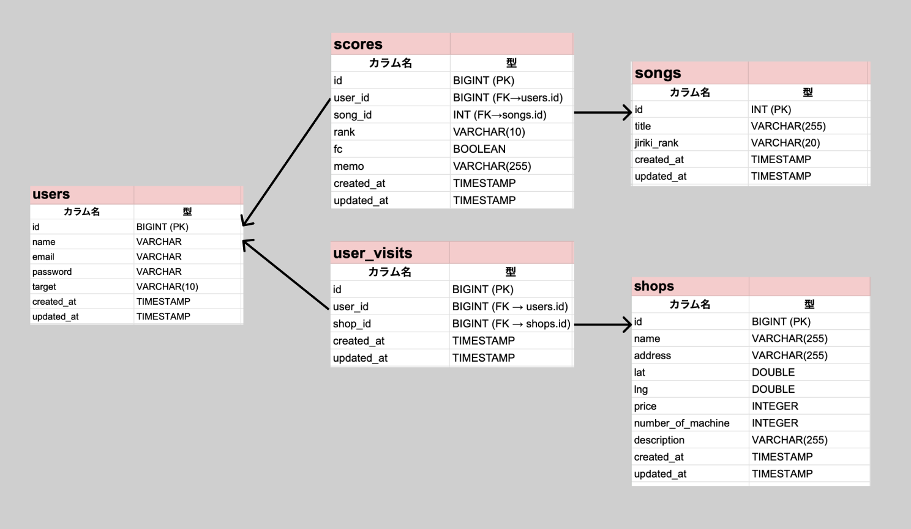
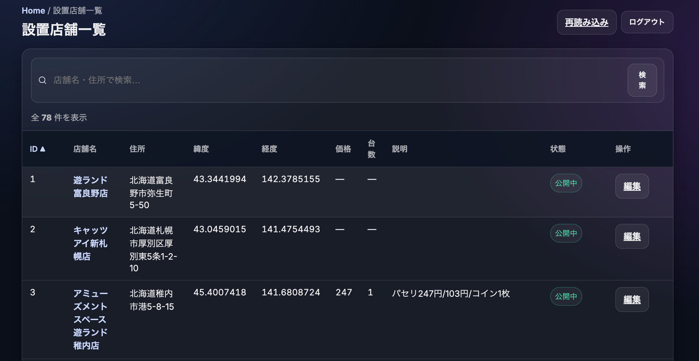
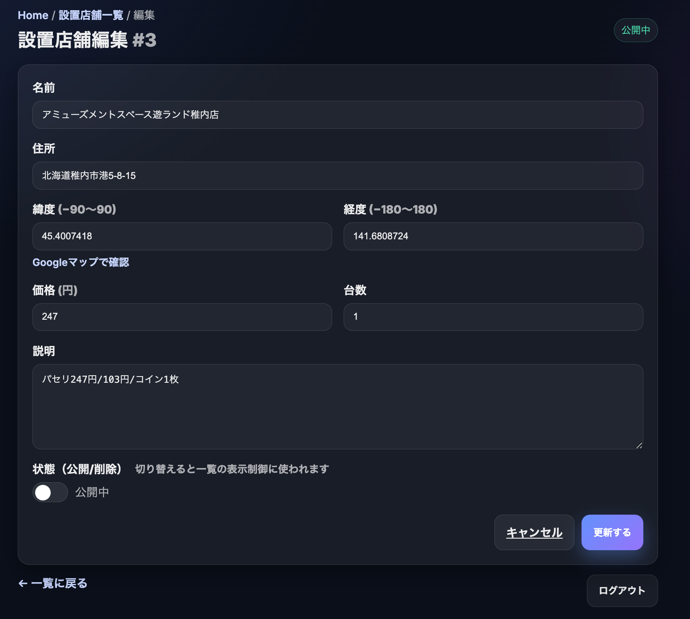

本リポジトリは、「REFLEC BEAT plus Lv11 難易度表＆クリアランク管理サイト」開発プロジェクトの 
[フロントエンド](https://github.com/misato729/score-manager-frontend)と[バックエンド](https://github.com/misato729/score-manager-backend) の統合リポジトリである。

# フロントエンド概要
**REFLEC BEAT plus Lv11 難易度表＆クリアランク管理サイト**
- **目的**：音楽ゲーム REFLEC BEAT plus のLv11のクリアランク・フルコンボ状況の管理を行う。
- **機能**：
  - Lv11の譜面を非公式に10段階に定義した「難易度表」を閲覧可能
  - 譜面ごとにクリアランク・フルコンボ状況を保存
  - Google Maps APIで店舗情報閲覧＆チェックイン機能
- **使用技術**：Vue 3 + TypeScript / Laravel 12 / PostgreSQL / Vercel + Render
- **URL**：[https://rbplus-rank-manager.site](https://rbplus-rank-manager.site)

- **画面イメージ**
### TOP画面

### 難易度表画面

### 設置店舗マップ画面

- **例**（開発者のマイページ）
  - [難易度表](https://rbplus-rank-manager.site/dashboard?user=10)
  - [行脚履歴](https://rbplus-rank-manager.site/visited_shops?user=10)

## 背景
音楽ゲーム上級者の間では、公式難易度に加えて有志により作成された非公式の「難易度表」が活用されることが多い。 
例えばKONAMIの人気音楽ゲーム「beatmania ⅡDX」は最高レベルは12であるが、Lv12の中でも難易度の差が激しく、有志によってLv12をさらに数段階に分ける試みがなされている。 
近年では、難易度表をWebアプリ化してクリアランクを管理する試みがなされている。 

※参考： 
- [12参考表(地力表)支援サイト](https://sp12.iidx.app)
- [CPI](https://cpi.makecir.com)
 
この難易度表の存在により、プレイヤーは実力に見合った適切な難易度の曲を選ぶことができる上、自分のプレイ進捗を可視化できる。 
 
一方、同じくKONAMIの音楽ゲーム「REFLEC BEAT」は「beatmania ⅡDX」と比べるとマイナーなゲームであり、このようなWebアプリがまだ存在していない。 
そこで私は、「REFLEC BEAT」においても上記のような難易度表のWebアプリを作成し、プレイヤーのモチベーション維持に貢献するため開発に至った。

## URL
https://rbplus-rank-manager.site 

※検証用アカウント 
メールアドレス：test@example.com 
パスワード：password 

# 構成図
## アーキテクチャ構成図

このシステムはユーザー向け画面と管理画面に分かれている。
ユーザー向け画面のフロントエンドはVue 3 + Vite を用いたSPAとして構築されており、バックエンドのLaravel（Breeze + Sanctum）とAPIで連携したセキュアな認証処理を実装している。インフラはVercelにホストしている。
管理画面はLaravel Bladeでフロントエンドを構築し、API経由ではなく直接DBにアクセスしている。インフラはRenderにホストし、無料プランのスリープ対策としてGoogle Apps Scriptで10分に1回自動的にアクセスを行うスクリプトを組んでいる。

DNS管理はムームードメインで行い、ドメイン名 `rbplus-rank-manager.site` によって独自ドメインで運用している。

## データベース構成（ER図）

本アプリでは、ユーザー・楽曲・スコア・設置店舗・訪問履歴の5つのテーブルを中心に構成されている。  
リレーションの明確化と正規化を重視した設計とし、拡張性や保守性を考慮している。

# 機能一覧
本アプリの機能は、メインの「難易度表閲覧・クリアランク管理」機能と、サブ要素として開発した「設置店舗閲覧・行脚」機能の2つに分かれる。
## 難易度表閲覧・スコア管理
### 非ログインユーザー向け
- 「REFLEC BEAT plus」収録のレベル11の全譜面について、地力ごとに分類したものを表示する（地力は非公式の10段階：地力F〜地力S+）
### ログインユーザー向け
- 各ユーザーは曲に対してランク（AAA+/AAA/...）、フルコンボの可否、メモを保存することができる
- 曲に対してランクをプルダウンで選択すると、曲のカードがランクに対応する色に変化する
- FC（フルコンボ）をチェックボックスで選択すると、曲のカードがFULL COMBO!!と表示される
- 超上級者向けの機能として、AAA+(95%)以上のランクを1%刻みで管理できる「Expertモード」を選択できる
- Expertモードで「100%」のランクを選択すると、曲のカードがEXCELLENT!!!と表示される
- フィルター機能があり、ランクとフルコンボ/未フルコンボで絞り込みができる
- 各ユーザーは目標ランクを設定することができ、目標に対する進捗状況をプログレスバーで視覚的に確認できる
- 「全体」プログレスバーは目標ランクの達成曲数／全曲数から達成率を計算し、対応ランクの色で表示される
- 「FC」プログレスバーはフルコンボ数／全曲数から達成率を計算し、ピンク色で表示される

## 設置店舗閲覧・行脚
### 非ログインユーザー向け
- アーケード版「REFLEC BEAT」の設置店舗を地図上で確認できる
- Google Maps上にピンが立っており、クリックすると店舗詳細を確認できる
- 詳細情報では1クレ料金、台数、メンテ状況、他音ゲー情報を確認できる
### ログインユーザー向け
- ユーザーは、訪問した店舗を位置情報によるチェックインで記録することができる（これを「行脚」という）
- 店舗に近づくと店舗一覧画面に「チェックインする」ボタンが表示される
- 訪れたことのある店舗を「行脚履歴」画面で確認することができる（表示項目は「都道府県」「店舗名」「訪問日時」）

## その他機能
- ユーザーは、アカウントの新規登録・ログイン・ログアウト・削除をすることができる
- お問い合わせフォームまたはGmail、公式Xから開発者への連絡や設置店舗の情報提供ができる

# 使用技術

| 分類          | 使用技術・サービス                                      |
|---------------|---------------------------------------------------------|
| フロントエンド | Vue 3, Vite, TypeScript, Pinia, Vue Router, Axios     |
| バックエンド   | Laravel 12, Laravel Breeze, Laravel Sanctum, Laravel Blade     |
| インフラ       | Vercel（フロントエンド）, Render（バックエンド/DB）           |
| データベース   | SQLite（ローカル環境）, PostgreSQL（本番環境/Render）         |
| デザイン       | Figma（画面設計）|
| その他         | Google Maps API, GitHub, ChatGPT |

# CI/CD
本プロジェクトは GitHub Actions + Vercel による CI/CD を導入している。
- **Lint / Typecheck / Unit Test**: ESLint, tsc, Vitest
- **Preview Deploy**: PR 作成時に Vercel の Preview 環境へ自動デプロイ  
- **E2E Test**: Preview URL に対して Playwright による E2E テストを実行  
  - Vercel の「Protection Bypass for Automation」を利用して GitHub Actions から Preview 環境にアクセス可能に設定
- **Production Deploy**: main ブランチへの push で Vercel 本番に自動デプロイ

# バックエンド概要

用途は以下の2つである。

① フロントのAPIリクエスト（スコアの取得・更新、設置店舗の取得など）に返答する。

② Laravel Bladeで開発したバックエンド直結（SSR）の管理システムで設置店舗情報の管理を行う。

当初は①のみでリリースしていたが、管理システムでデータを管理できた方がサービス運用が楽になると思い、②の開発にも至った。

# 機能一覧

## ① APIレスポンス
本APIは、フロントエンドとのデータ送受信に利用する。
全エンドポイントは JSON 形式でレスポンスを返す。
認証が必要なエンドポイントは Laravel Sanctum によるトークン認証を使用。

### ユーザー関連
| メソッド   | エンドポイント          | 認証 | 概要                    |
| ------ | ---------------- | -- | --------------------- |
| POST   | `/login`         | 不要 | メールアドレス・パスワードでログイン    |
| POST   | `/register-user` | 不要 | 新規ユーザー登録（スコア初期化含む）    |
| GET    | `/user`          | 必要 | ログイン中ユーザーの情報を取得       |
| POST   | `/logout`        | 必要 | ログアウト（Sanctumトークン無効化） |
| DELETE | `/users/{id}`    | 必要 | ユーザーアカウント削除           |
| PUT    | `/users/target`  | 必要 | ユーザーのターゲットスコア設定を更新    |

### スコア関連
| メソッド | エンドポイント           | 認証 | 概要               |
| ---- | ----------------- | -- | ---------------- |
| GET  | `/scores`         | 不要 | 全ユーザーのスコア一覧を取得   |
| GET  | `/user-scores?user={id}`    | 不要 | {id}のユーザーのスコア取得 |
| POST | `/scores`         | 必要 | 新しいスコアを登録        |
| PUT  | `/scores/{score}` | 必要 | 既存スコアを更新         |

### 店舗関連
| メソッド | エンドポイント          | 認証 | 概要             |
| ---- | ---------------- | -- | -------------- |
| GET  | `/shops`         | 不要 | 店舗一覧を取得        |
| POST | `/visit`         | 必要 | 行脚店舗を登録        |
| GET  | `/visited`       | 必要 | 自分の行脚店舗履歴を取得   |
| GET  | `/visited-shops?user={id}` | 不要 | {id}のユーザーの行脚履歴を取得 |

## ② 管理システム
本管理システムは **Laravel Blade（SSR）** を用いて実装したバックエンド直結の管理画面であり、API経由ではなく直接データベースにアクセスして管理を行う。

### 機能概要
- **店舗一覧表示**  
  - すべての店舗情報をID順で表示  
  - 店舗名や住所の部分一致検索機能
  - 公開中／削除済みの状態表示

- **店舗編集**  
  - 店舗名、住所、緯度経度、価格、台数、説明文、論理削除フラグを更新可能  
  - バリデーションチェック付き（必須項目・文字数・数値型）

- **論理削除**  
  - `is_deleted` フラグをON/OFFすることで、実データを残したまま表示制御
- **UIデザイン**  
  - CSSとシンプルなBlade構文によるレスポンシブ対応デザイン 
  - 成功／エラー時のトースト通知表示

### アクセス制御
- Laravel Sanctumによる認証
- ミドルウェアによって、環境変数 `ALLOWED_USER_ID` に設定されたユーザーID（自分）のみアクセス可能
- 未認証時はログイン画面へリダイレクト
- 認証済みでも許可されたID以外はHTTP 403を返却

### 技術ポイント
- Bladeディレクティブ（`@if`, `@foreach`, `@csrf`, `@method` など）を活用
- ルーティングは `routes/web.php` に定義、`AdminShopController` で処理
- 管理画面とAPIのルーティングを分離（`web.php` と `api.php`）
- HTTPS強制設定（`AppServiceProvider` + RenderのForce HTTPS）

### 関連記事
- [Laravel Bladeで管理画面を作ってみた【MVC】](https://qiita.com/misato729/items/138a89c3ad8b3e2f0716)  
  → 管理画面（店舗CRUD）を作る過程を整理した学習アウトプット記事です。

# CI/CD
本プロジェクトでは **GitHub Actions + Render** を用いた CI/CD を構築している。  
プルリクエストから本番デプロイまで自動化されており、安全かつ効率的な開発フローを実現している。

- PHPUnitによるFeatureテストを自動実行
- Laravel Factory を活用し、再現性のあるテストデータを生成
- テストが失敗するとマージ不可 (レビュー時に検知)
- `main`ブランチにマージされると Render へ自動デプロイ

# 今後の展望
管理画面について、現在は設置店舗情報の管理機能のみだが、ユーザー管理機能や楽曲管理機能もつけていきたい。

## 各リポジトリリンク
- [フロントエンド](https://github.com/misato729/score-manager-frontend)  
- [バックエンド](https://github.com/misato729/score-manager-backend)  
